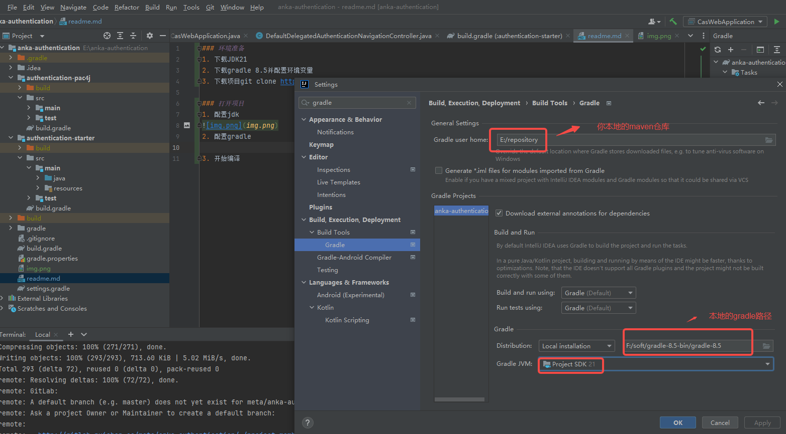
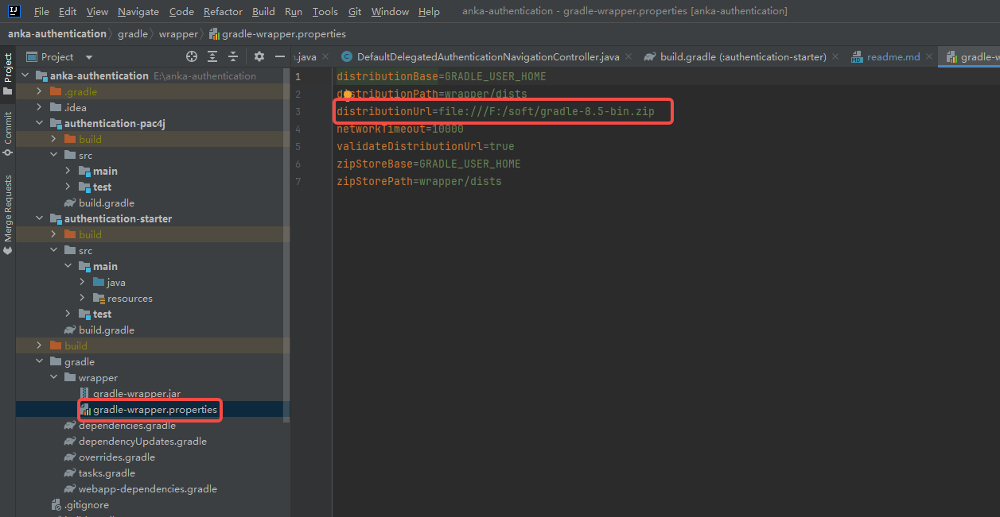
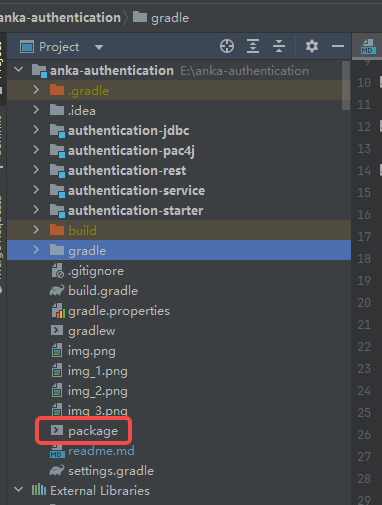

## 环境准备
- 下载JDK21 
https://download.java.net/java/GA/jdk21.0.2/f2283984656d49d69e91c558476027ac/13/GPL/openjdk-21.0.2_windows-x64_bin.zip
https://download.java.net/java/GA/jdk21.0.2/f2283984656d49d69e91c558476027ac/13/GPL/openjdk-21.0.2_linux-x64_bin.tar.gz

- 下载gradle 8.5并配置环境变量 https://gradle.org/next-steps/?version=8.5&format=bin
- 下载项目git clone http://gitlab.ruishan.cc/meta/anka-authentication.git

## 开始
-  配置jdk

- 配置gradle

- 修改项目gradle地址,指向本地磁盘

- 等项目自动构建吧，没反应就,点击下build \

## 启动
- 目前项目结构 \
---anka-authentication  //项目根  \
--------authentication-jdbc   //去数据库认证 \
--------authentication-pac4j   //对接第三方包，比如微信、钉钉、第三方身份源等 \
--------authentication-rest   //第三方接口认证 \
--------authentication-service   //应用对接数据库 \
--------authentication-starter  //启动包,新增的module都要在这个里面依赖一下\
--------gradle                  //gradle构建用的包括一些依赖\
-----------xxxx.gradle          //高级用法,了解不深\
--------build.gradle            // 本项目构建\
--------gradle.properties       // 所有依赖版本号

- 项目启动类 CasWebApplication.java
- 配置文件 resources/application.properties
- 前端文件 resources/templates

## 打包
- 执行package命令\

- 可执行jar包会输出到  authentication-starter/build/libs/authentication-starter-7.0.4.jar

## 如何新增功能

- 查看cas7.0.4源码 gitlab已上传 https://gitlab.ruishan.cc/yangyuanliang/cas
- 找到你想要新的功能对应的模块
- 在当前项目中新增或者已有module中添加依赖
- 依赖都要在对应module的build.gradle中添加
- 查看cas源码找到对应模块的测试类。
- 把测试类的配置拷贝到 resources/application.properties
- 启动测试就ok

