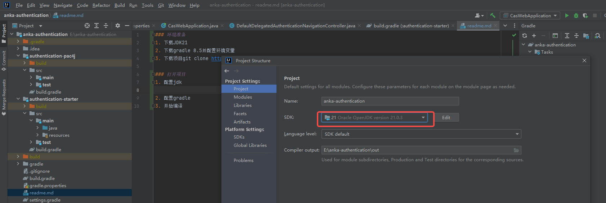
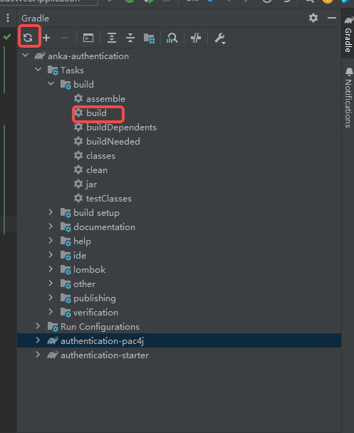

### 环境准备
1. 下载JDK21 
2. 下载gradle 8.5并配置环境变量
3. 下载项目git clone http://gitlab.ruishan.cc/meta/anka-authentication.git

### 开始
1. 配置jdk

2. 配置gradle

3. 修改项目gradle地址,指向本地磁盘

4. 等项目自动构建吧，没反应就,点击下build

### 启动
1. 目前项目路径

---anka-authentication  //项目根

--------authentication-pac4j   //对接第三方包，比如微信、钉钉、第三方身份源等

--------authentication-starter  //启动类,新增的module都要在这个里面依赖一下

--------gradle                  //gradle构建用的包括一些依赖

-----------xxxx.gradle          //高级用法,了解不深

--------build.gradle            // 本项目构建

--------gradle.properties       // 所有依赖版本号

2. 项目启动类 CasWebApplication.java
3. 配置文件 resources/application.properties
4. 前端文件 resources/templates